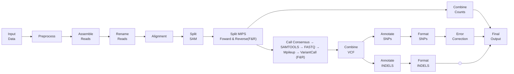

# smMIPS MRD workflow description
## Introduction

&emsp;This repository describes the bioinformatics workflow for analysing MRD samples sequenced using smMIPS based panel. Sample libraries were sequenced on a NovaseqX platform using 2x150 bp reads. Each sample was allocated ~40 million reads. This panel consists of 147 smMIPS covering 18 commonly mutated hotspot genes in AML. Regions covered by these probes are mentioned in the .txt and .txtR files present in the ``assets`` folder. Each probe has a 4 bp UMI tag at both ends which is combined in a 8 bp molecular tag.  
&emsp; Reads were preprocessed using to remove adapters and low quality bases (Q<20). Filtered reads were paired-end assembled and mapped to the human genome (build hg19). Reads originating from the same UMI family were collapsed to obtain consensus reads. Pileup of these reads was obtained after realigning them. Variant calling was performed using a customized variant caller followed by annotation. A site and mutation-specific error model was used to distinguish true SNPs from the background noise. Detailed steps to generate the site and mutation specific error model are mentioned in [error model md](error_model.md) file. 

## Pipeline summary

## References
Execution of this pipeline requires certain reference files. These need to be downloaded and the following parameters need to be modified in the `params` section of the `nextflow.config` before executing the workflow : 
- *genome* = Complete path to the human genome fasta file(hg19_all.fasta). Please ensure that the BWA index files (hg19_all.fasta.fai, hg19_all.fasta.amb, hg19_all.fasta.ann, hg19_all.fasta.bwt, hg19_all.fasta.pac, hg19_all.fasta.sa) are also present in the same genome folder. The assests folder currently contains placeholder genome and index files.

- *annovar_humandb* = Complete path to the humandb database folder for [ANNOVAR](https://annovar.openbioinformatics.org/en/latest/user-guide/startup/ "annovar site")

- *gen_ref*	= Complete path to the gene_fullxref.txt file as downloaded from the [ANNOVAR](https://annovar.openbioinformatics.org/en/latest/user-guide/startup/ "annovar site") site

- *bedfile* = This file needs to be updated based on the probes used for the assay

- *outdir* = Location to write the output folder

Parameters *smMIPS_txt_file* and *smMIPS_txtR_file* provide the location of files containing smMIP list on the forward and reverse strand respectively. *matrix* parameter gives the location of file with alpha and beta values of the error model. *indel_filter_list* is a list if INDELS present in 3 or more biological negative controls used to train the model. 

## Usage
1. Transfer the sample input files `*.fastq.gz` inside the `sequences/` folder.

2. Modify the `samplesheet.csv`. The sample_ids, without the file extension, should be mentioned in samplesheet in the following format - <br>
sample1  
sample2  
sample3  
Please check for empty lines in the samplesheet before running the pipeline.

3. To execute the pipeline, use the following command
```bash
nextflow -C nextflow.config run sal_mips.nf -entry MIPS -bg -profile docker -resume
```

## Output
Samplewise output folders are written to the folder name mentioned in the `outdir` param in the config file.
Individual output folder contains:  
- bamfolder: This folder contains probewise .bam and .bai files 
- Samplename_INDEL.csv : File containing annotated INDELS.
- Samplename_error_corrected.csv : File containing annotated SNPs with the Pvalue and background error obtained from the error model. Variants with Pvalue < 0.005 were selected for analysis. 
The column titled background has the % background error, calculated as ( (mean error rate + ( 3 * standard deviation on error )) * 100 ).  
- Samplename_mip_counts.txt : File containing the counts of reads in a given family size for each smMIP, starting with a family size of 1 (singletons) till 51.  
The second last column is the sum of all reads for each probe including singleton reads while the last column gives the sum of reads for each probe excluding the singleton reads.
- Samplename_SNP.csv: File with annotated SNPs without the error model data

## Citation
If you use this pipeline in your research, please cite:
```
Leukemic stem cell MRD refines relapse-risk beyond conventional FCM and NGS-based approaches in intensively treated AML. 2026
```

## Contact
[Patkarlab](https://github.com/patkarlab)